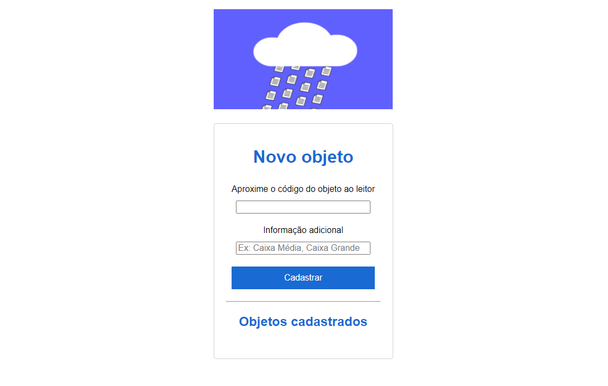

# # Autenticação via RFID

### Atividade da matéria de Comunicação de Dados - Faculdade UNISATC (SC) 

### Este código realiza funções de cadastro e validação de TAGs ou Cartões por meio de um servidor hospedado localmente utilizando um módulo RFID.

#

   
  Print do Navegador

