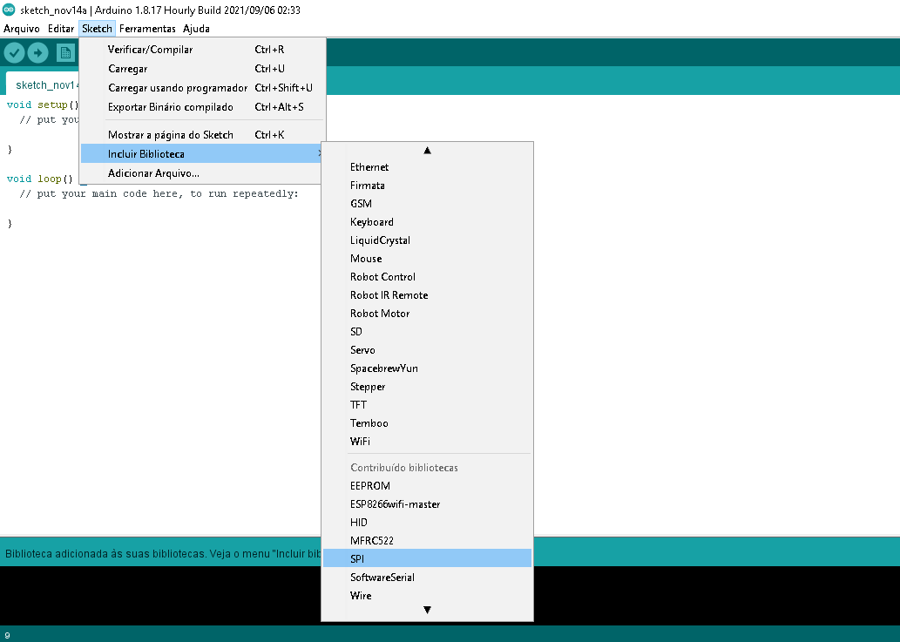

# # Autenticação via RFID

### Atividade da matéria de Comunicação de Dados - Faculdade UNISATC (SC) 

### Este código realiza funções de cadastro e validação de TAGs ou Cartões por meio de um servidor hospedado localmente utilizando um módulo RFID.

#

## # Hardware Necessário

- Módulo RFID-RC522
- Cartão Mifare 13.56Mhz
- Tag Mifare 13.56Mhz
- Buzzer Ativo 5V
- Protoboard
- ESP8266 D1 R1
- LED Vermelho e Verde (ou LED RGB)
- 2 resistores de 330R
- Cabos para conexão

#

## # Ligações no ESP8266 D1 R1 (respectivamente)

- LEDs (ou LED RGB) conectados em `D2 e D4` (Verde e Vermelho)
- Módulo RFID-RC522 conectado em `D8, D5, D7, D6, D3, 3.3V e GND` (SDA, SCK, MOSI, MISO, RST, VCC e GND)
- Buzzer Ativo 5V conectado em `D9 e GND`

#

## # Inclusão de Blibiotecas e Auxiliares

- Download da biblioteca ESP8266WiFi e a inclusão da mesma em Sketch>incluir biblioteca>adicionar biblioteca.zip

   

- Download da biblioteca ESPAsyncTCP e a inclusão da mesma em Sketch>incluir biblioteca>adicionar biblioteca.zip

   

- Download da biblioteca ESPAsyncWebServer e a inclusão da mesma em Sketch>incluir biblioteca>adicionar biblioteca.zip

   

- Download da biblioteca ESP8266SPIFFS e a inclusão da mesma em Sketch>incluir biblioteca>adicionar biblioteca.zip

   

- Seleção do SPI em Sketch>incluir biblioteca>SPI

   

- Instalação da biblioteca MFRC522 já inclusa no arduino em Sketch>incluir biblioteca>gerenciar bibliotecas

   

- Vector(array) já vem incluso no arduíno, não é necessário instalação. O Vector é uma coleção de variáveis que são acessadas com um número índice. Vetores do arduíno são baseados na linguagem C++.

#

## # Finalizando

### Após todos esses passos basta rodar o código na IDE, quando ele terminar de compilar abra o Console e desative a Auto-rolagem, em alguns segundos irá aparecer o IP alocado para uso embaixo de [CONNECTED] (caso você já ter ajustado no código o campo `char ssid[]` e `char password[]` com os dados de sua rede, do contrário irá ficar conectando infinitamente).

#

   
  Print do Navegador

